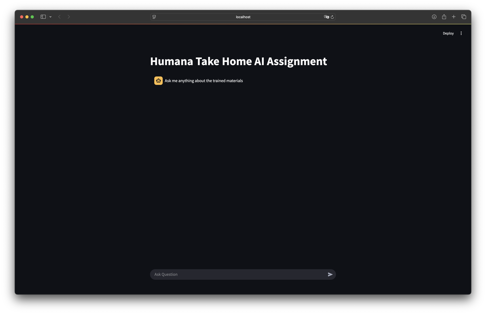

# Humana Take Home Assignment
Author: Sanidhya Mangal

## Problem Statment
Develop a chatbot to read [published](https://www.researchgate.net/profile/Gary-Clark/publication/19364043_Slamon_DJ_Clark_GM_Wong_SG_Levin_WJ_Ullrich_A_McGuire_WLHuman_breast_cancer_correlation_of_relapse_and_survival_with_amplification_of_the_HER-2neu_oncogene_Science_Wash_DC_235_177-182/links/0046352b85f241a532000000/Slamon-DJ-Clark-GM-Wong-SG-Levin-WJ-Ullrich-A-McGuire-WLHuman-breast-cancer-correlation-of-relapse-and-survival-with-amplification-of-the-HER-2-neu-oncogene-Science-Wash-DC-235-177-182.pdf) material and have capabilities to answer all the user queries related to the research paper.

### Assumptions
#### Functional
- All the data loaded would be from local filesystem and would be either `.pdf` or `.docx`
- Chatbot shall be able to retain past conversation and answer follow up questions.
- Chatbot shall only answer from the provided context, nothing from internet knowlege.
- Chatbot shall be able to expand knowledge base as per requirements.
- Chatbot is designed for english language. Users follow standard lingustic structure over complex jargons.
- Chatbot is uni-modal, i.e., only supports text, tables, etc. 
- If chatbot cannot fulfill any user request, shall direct user to look for online material.
- Chatbot should quote its sources or references for all the user queries.

#### Non-Functional
- Chatbot shall maintain proper API connectivity with the LLM models, reterival agent, etc.
- Chatbot should only answers related to the provided context, shall not include any internet knowledge.
- Provided research material provides all the context to answer all the relevant user query.
- The quality of information/research material is up-to-date, accuracte and free of any ambiguity error.
- Chatbot is able to retrieve relevant chunk of material without any human intervention.
- Selected LLM understand both user queries and retrieved context correctly and synthesize the responses.
- Core assumption is LLM will stick to the retrieved chunk of information, minimizing "halucinations".
- System shall have stable performance over the time.

## Approach
To develop an effective chatbot for a QnA we can develop a RAG based agent to effectively serve user requests without fine-tuning LLMs, one key benefit with this approach is, it helps in reducing hallucination within responses and create a better and streamlined. For a RAG agent we need to develop below mentioned modules:
- Develop a vectorizer module to vecotrize all the textual information from data data scource into embedding vectors.
  - For this project we will use mini-llm-v6 vectorizer to embedd all the information and store it as local embeddings. In an ideal real-world production we can use online vector store such as `Pinecone`, `AzureAISearch`, etc.
- Design or write system prompt, user instructions, or task prompts. This is crucial step for any RAG based agent, since performance of GenAI based LLMs are directly correlated to prompts, or instructions supplied.
  - For this project we will write our own custom system prompt, task prompt would be handled by orchestrator -> `llama-index`, if required we can write refinement prompt to enhance response synthesis.
- Agent Config: In this module we would define all the agent configuration, such as which LLM to use, nature of agent whether it is `ReActive`, `Contextual`, `Simple`, etc.
  - Since this tool focuses on simple QnA reterival, therefore we would create a basic agent with context reterival properties to restrict user to only focus on provided information, no internet knowledge.
- Evaluation, this module delineates evaluation metrics such as, _faithfulness_, _relevancy_, _correctness_, etc. to evaluate agent's performance and define how accuracte a chatbot is in answering the questions.
  - To evaluate the performance of this chatbot we defined the evaluation module to evaluate the performance on _faithfulness_, _relevancy_, _correctness_ metrics. To evaluate I cherry picked 5 random questions from the pdf file to develop a test data.
- UI: An UI element to debug and test out Chatbot, more like a playground before exposing it to external system as an API.
  - Used `streamlit` to develop a playground UI.

## Evaluation Metrics:
To evaluate chatbot's performance, 5 random questions were cherry picked along with ground truth value. 
- *Faithfulness*: Metric to evaluates whether a response is faithful to the contexts (i.e. whether the response is supported by the contexts or hallucinated.). After extensive testing, chatbot had a score of _100%_ on faithfulness.
- *Relevancy*: Metric to evaluates the relevancy of retrieved contexts and response to a query. This evaluator considers the query string, retrieved contexts, and response string. After extensive testing, chatbot had a score of _100%_ on relevancy score, meaning all the responses passed this test.
- *Correctness*: Metric to evaluates the correctness of a question answering system. This evaluator depends on ground truth answer to be provided, in addition to the query string and response string. It outputs a score between 1 and 5, where 1 is the worst and 5 is the best, along with a reasoning for the score. Post testing we got the mean score of _4.0_ signifying `~80%` of accuracy in responses.

### Other metrics
There are several other metrics which could be used for evaluation of chatbot such as:
- ContextRelevancy: Evaluates relevancy of retrieved contexts for the given query, didn't used already covered in relevancy.
- AnswerRelevancy: Evaluates relevancy of answer or response for the given query, didn't used already covered in correctness.
- Guidelines: To test if given query and response passes the provided guidelines. Assuming there is no strict guidelines to follow for development of this chatbot, therefore decided to omit this one.

> IMO, using evaluation metrics such as response time, etc, are trivial as they are directly dependent on model used, API latency, compute resources or configuration of APIs, therefore decided to skip development of script to capture them, and to capture those metircs we can simply add profiler to capture telemetry data and analyze them. 

## Project Strucure
```sh
.
├── app.py # entrypoint for streamlit
├── embeddings # vector index dir 
├── poetry.lock
├── pyproject.toml
├── README.md
├── ruff.toml
├── SlamonetalSCIENCE1987.pdf
├── src # root pkg directory
│   └── humana_take_home
│       ├── __init__.py
│       ├── agents # all agent configs
│       │   └── research.py
│       ├── evaluators # evaluator module
│       │   ├── evaluator.py
│       │   └── utils.py
│       ├── prompts # prompts module to house system prompt
│       │   └── research_paper.py
│       ├── scripts # scripts to run evaluator, vector documents
│       │   ├── run_evaluator.py
│       │   └── vectorize_documents.py
│       ├── timer.py
│       ├── utils.py
│       └── vectorizers # vectorizer module to house all vectors
│           └── pdf.py 
├── test_data.csv
└── test_results.csv
```

## Running Application
This application require `python>=3.10` installation for running. Before running there are certian prerequisitie steps to run it. Such as setting up environment, installing Ollama, etc. Please find below detailed steps to setup development environment.

### Dev Environment / Runtime Env Setup.
Application uses poetry for package management for hassle free dependency installation, if there is no active poetry installation within your system it could be installed by following instructions mentioned [here](https://python-poetry.org/docs/#installation).

After sucessful installation of poetry, please run `poetry install` to install necessary packages within your virtual env. If the source package is not installed, run above mentioned command again to install `humana-take-home` pkg within your virtual environment.

Application uses `Ollama` in background for running LLM models, If there is not an active installation, please download and install it from [here](https://ollama.com) and install it.

The application uses [`mistral:7b`](https://ollama.com/library/mistral) model to run the application. Therefore, post sucessful installation of `Ollama` please run following command to download the model: `ollama pull mistral:7b`. If you wish to play around with this model, run `ollama run mistral:7b` it will load model in `CLI` mode and make your terminal powerhouse of serving LLMs.

> Application is model agnostic, you can use any Ollama model to run it. Just need to download the model update `OLLAMA_MODEL` env variable accordingly.

Chatbot uses `HugginfaceEmbedding` to vectorize text, it auto downloads all the necessary files from huggingface. No additional step is requried to set it up. It uses `sentence-transformers/all-MiniLM-L6-v2` by default, to use other huggingface model please specify it in _env variable_.

#### Setting Env Variables
Application relies on environment variables to select embedding models, llm model and path of vectorized indexes to run somoothly without any additional configuration. Repo already contains `.env` file to load necessary env variables. Users can specify following environment variables either in `.bashrc` or directly using `export VARIABLE=VALUE`.

##### Env Variables
```sh
EMBEDDINGS_MODEL="sentence-transformers/all-MiniLM-L6-v2"
OLLAMA_MODEL="mistral:7b"
VECTOR_INDEX_PATH="embeddings" # path to vector index flushed to local storage after vectorizing document.
```

### Vectorizing Document
Repo already contains vectorized embeddings (`embeddings`) in root folder which could be directly used for spining up the streamlit. To create embeddings from scratch please run `vectorize_documents.py` script using `poetry run python src/humana_take_home/vectorize_documents.py --options`.

Vectorizing script supports following options:
```
usage: vectorize documents into text embeddings [-h] [--input_dir INPUT_DIR] [--input_files [INPUT_FILES ...]] [--vector_path VECTOR_PATH]

options:
  -h, --help            show this help message and exit
  --input_dir INPUT_DIR
                        directory path to index all the documents
  --input_files [INPUT_FILES ...]
                        list of files to index
  --vector_path VECTOR_PATH
                        path to flush vectorized indexes
```
> Replace `--options` with above mentioned options.

### Running UI
A mock UI is developed using `streamlit`, to run app and spin up UI please use following command:
```sh
poetry run streamlit run app.py
```

> While running the application, you might see some `RuntimeError` from torch, please feel free to ignore it, it's mostly in background. The application would still be up and running. It's some torch library issue. 

After running this command if the UI is not open in default browser, please check for any environment variable error. If none, yet UI doesn't load, please follow the local url mentioned in the console. UI should look like this after sucessful run.



### Evaluation
To evaluate chatbot's performance, please run following command to execute `run_evaluator.py` script:
```sh
poetry run python src/humana_take_home/scripts/run_evaluator.py --options
```

Evaluation script follows following options:
```sh
usage: evaluate trained chatbot [-h] --path_to_csv_file PATH_TO_CSV_FILE [--use_correctness] [--export_results_path EXPORT_RESULTS_PATH]

options:
  -h, --help            show this help message and exit
  --path_to_csv_file PATH_TO_CSV_FILE
                        path to the csv file containing the evaluation data
  --use_correctness     use correctness evaluator
  --export_results_path EXPORT_RESULTS_PATH
                        path to export the evaluation results
```

Repo consists test data with queries and ground truth within `test_data.csv`, you can append or create your own test data using this file as sample.

> Replace `--options` with above mentioned options.

## Next Steps
- To improve performance of LLM response we can integrate better models with high parameters, as currently, app uses a `7b` param model.
- Vectorized documents could be stored in cloud.
- Add `re_rank` strategies to improve reterival performance.
- Use parsers like `LlamaParse` to parse text better, and add new metadata to filter research material from single file.
- Expose chatbot as an API for mobile, web or desktop consumption.
